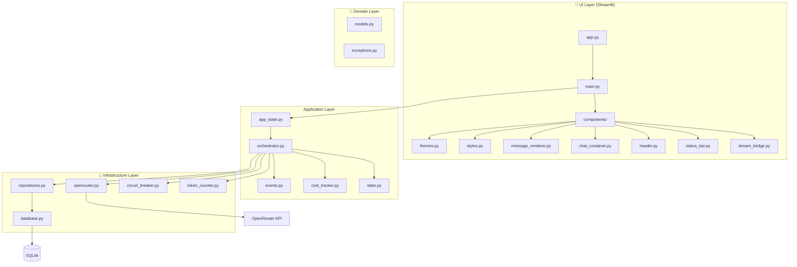
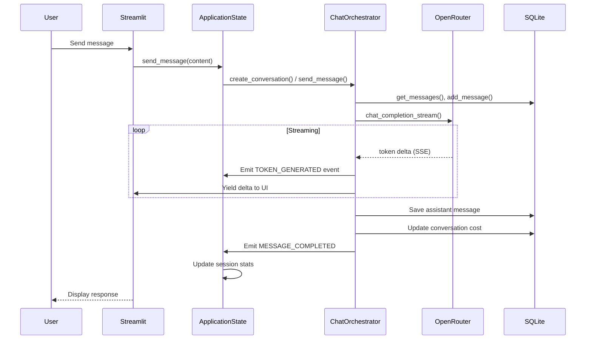

# Neural Terminal ⚡

<div align="center">

[](https://www.python.org/downloads/)
[](https://opensource.org/licenses/MIT)
[]()
[](https://streamlit.io/)
[](https://docker.com/)

</div>

> A **production-grade chatbot interface** with OpenRouter integration, featuring a distinctive terminal/cyberpunk aesthetic. Built with clean architecture, type safety, and comprehensive testing.

---

## ✨ Features

### 🤖 AI Model Support
| Feature | Description |
|---------|-------------|
| **Multi-model** | GPT-4, GPT-3.5, Claude 3, Gemini Pro, Llama 2, Mistral |
| **Real-time Streaming** | Live token-by-token responses via SSE |
| **Context Management** | Automatic truncation with tiktoken |

### 💰 Cost Tracking & Budget
| Feature | Description |
|---------|-------------|
| **Per-message Costs** | Real-time cost calculation per message |
| **Session Tracking** | Cumulative cost across conversations |
| **Budget Enforcement** | Warnings at 80%, block at 100% |

### 🎨 Terminal Aesthetic
| Theme | Accent | Description |
|-------|--------|-------------|
| **Terminal Green** | `#00FF41` | Matrix-style with glow effects |
| **Cyberpunk Amber** | `#FFB000` | Retro-futuristic phosphor |
| **Minimal Dark** | `#569CD6` | Clean VS Code-inspired |

### 🔒 Production-Ready
- **XSS Protection** via Bleach sanitization
- **Circuit Breaker** pattern for API resilience
- **SQLite** with WAL mode for persistence
- **330+ Tests** with 90% coverage

---

## 🚀 Quick Start

### Prerequisites
- Python 3.11+ | Docker | Poetry

### Option 1: Docker (Recommended)

```bash
# Clone and run
git clone https://github.com/nordeim/neural-terminal.git
cd neural-terminal
cp .env.example .env
# Edit .env with your OPENROUTER_API_KEY

# Start with Docker Compose
docker-compose up -d

# Or build manually
docker build -t neural-terminal .
docker run -p 7860:7860 -e OPENROUTER_API_KEY=your-key neural-terminal
```

### Option 2: Local Development

```bash
# Install dependencies
poetry install

# Set API key
export OPENROUTER_API_KEY="your-key"

# Run application
make run
# or: poetry run streamlit run app.py

# Available at http://localhost:7860
```

---

## 🏗️ Architecture



---

## 📁 Project Structure

```
neural-terminal/
├── 🎯 app.py                    # Streamlit entry point
├── 📦 pyproject.toml           # Poetry dependencies
├── 🐳 docker-compose.yml        # Container orchestration
├── 🏭 Dockerfile               # Multi-stage build
├── ⚙️  Makefile               # Development commands
│
├── 🗂️  src/neural_terminal/
│   │
│   ├── 💎 domain/              # Core business logic
│   │   ├── models.py          # Conversation, Message, TokenUsage
│   │   └── exceptions.py      # 12 custom exception types
│   │
│   ├── 🔧 infrastructure/    # External concerns
│   │   ├── database.py        # SQLAlchemy ORM + SQLite
│   │   ├── repositories.py   # Data access (Repository pattern)
│   │   ├── openrouter.py     # Async API client with streaming
│   │   ├── circuit_breaker.py # Resilience pattern
│   │   └── token_counter.py  # Tiktoken wrapper
│   │
│   ├── 📱 application/         # Use cases & orchestration
│   │   ├── orchestrator.py   # ChatOrchestrator service
│   │   ├── events.py         # EventBus (Observer pattern)
│   │   ├── state.py          # StateManager
│   │   └── cost_tracker.py   # Budget tracking
│   │
│   └── 🎨 components/         # Streamlit UI
│       ├── themes.py         # 3 themes (Green, Amber, Dark)
│       ├── styles.py         # CSS generation & injection
│       ├── message_renderer.py  # XSS-safe rendering
│       ├── chat_container.py # Message display
│       ├── header.py        # Terminal header
│       ├── status_bar.py    # Cost display
│       ├── stream_bridge.py # Async-to-sync bridge
│       └── error_handler.py # Error display
│
├── 📜 scripts/                 # Utility scripts
│   ├── init_db.py            # Database initialization
│   ├── health_check.py        # Health monitoring
│   └── purge_conversations.py # Data cleanup
│
└── 🧪 tests/                  # Test suite (~330 tests)
    ├── unit/                 # 13 unit test files
    ├── components/           # 7 component tests
    └── integration/          # DB integration tests
```

---

## 🔄 Application Flow



---

## 📋 Key Files Reference

| File | Lines | Purpose |
|------|-------|---------|
| `app.py` | 30 | Entry point, path setup |
| `main.py` | 450 | NeuralTerminalApp orchestration |
| `app_state.py` | 400 | Global singleton state |
| `orchestrator.py` | 320 | Chat service, streaming |
| `openrouter.py` | 188 | Async API client |
| `circuit_breaker.py` | 167 | Resilience pattern |
| `repositories.py` | 220 | SQLite data access |
| `themes.py` | 340 | Theme definitions |
| `message_renderer.py` | 528 | XSS-safe rendering |

---

## 🎯 Usage Examples

### Send a Message
```python
from neural_terminal.application.orchestrator import ChatOrchestrator
from neural_terminal.infrastructure import *

# Create orchestrator
orchestrator = ChatOrchestrator(...)

# Stream response
async for delta, meta in orchestrator.send_message(
    conversation_id=uuid,
    content="Hello!",
    temperature=0.7
):
    print(delta, end="")
```

### Track Costs
```python
from neural_terminal.application.cost_tracker import CostTracker
from decimal import Decimal

tracker = CostTracker(event_bus, budget_limit=Decimal("10.00"))
# Automatically tracks via events
```

---

## ⚙️ Configuration

### Environment Variables

| Variable | Required | Default | Description |
|----------|----------|---------|-------------|
| `OPENROUTER_API_KEY` | ✅ Yes | - | Get from openrouter.ai |
| `DATABASE_URL` | No | `sqlite://...` | SQLite path |
| `DEFAULT_MODEL` | No | `gpt-3.5-turbo` | AI model |
| `BUDGET_LIMIT` | No | None | USD limit |
| `LOG_LEVEL` | No | `INFO` | DEBUG/INFO/WARNING |

### Available Models

| Model ID | Display Name |
|----------|--------------|
| `openai/gpt-4-turbo` | GPT-4 Turbo |
| `openai/gpt-4` | GPT-4 |
| `openai/gpt-3.5-turbo` | GPT-3.5 Turbo |
| `anthropic/claude-3-opus` | Claude 3 Opus |
| `anthropic/claude-3-sonnet` | Claude 3 Sonnet |
| `google/gemini-pro` | Gemini Pro |
| `meta-llama/llama-2-70b-chat` | Llama 2 70B |
| `mistral/mistral-medium` | Mistral Medium |

---

## 🛠️ Development Commands

```bash
# Installation
poetry install              # Install dependencies
poetry install --with dev  # With dev tools

# Testing
make test                  # All tests with coverage
make test-unit            # Unit tests only

# Code Quality
make lint                 # Ruff + MyPy
make format               # Black + Ruff

# Database
make db-init              # Initialize
make db-purge            # Clean old data

# Run
make run                  # Start app on port 7860
```

---

## 🐳 Docker Deployment

```bash
# Build
docker build -t neural-terminal .

# Run
docker run -p 7860:7860 \
  -e OPENROUTER_API_KEY=your-key \
  -v $(pwd)/data:/app/data \
  neural-terminal

# Docker Compose
docker-compose up -d
```

---

## 🧪 Testing

| Layer | Coverage | Tests |
|-------|----------|-------|
| Domain Models | ✅ High | 250 lines |
| Exceptions | ✅ High | 150 lines |
| Repositories | ✅ High | 400 lines |
| Orchestrator | ✅ High | 500 lines |
| Circuit Breaker | ✅ High | 350 lines |
| UI Components | ✅ Medium | 1260 lines |

---

## 🤝 Contributing

```bash
# Fork & Clone
git clone https://github.com/nordeim/neural-terminal.git
cd neural-terminal

# Create feature branch
git checkout -b feature/awesome-feature

# Develop
poetry install
make test

# Commit & Push
git add .
git commit -m "Add awesome feature"
git push origin feature/awesome-feature

# Open PR
```

---

## 📄 License

MIT License - See [LICENSE](LICENSE) file.

---

## 🙏 Acknowledgments

- [OpenRouter](https://openrouter.ai/) - AI model aggregation
- [Streamlit](https://streamlit.io/) - Web framework
- [SQLAlchemy](https://www.sqlalchemy.org/) - Database ORM
- [Tiktoken](https://github.com/openai/tiktoken) - Token counting

---

<div align="center">

**Built with ⚡ by the Neural Terminal Team**

[](https://github.com/nordeim/neural-terminal)
[](https://github.com/nordeim/neural-terminal)

</div>
